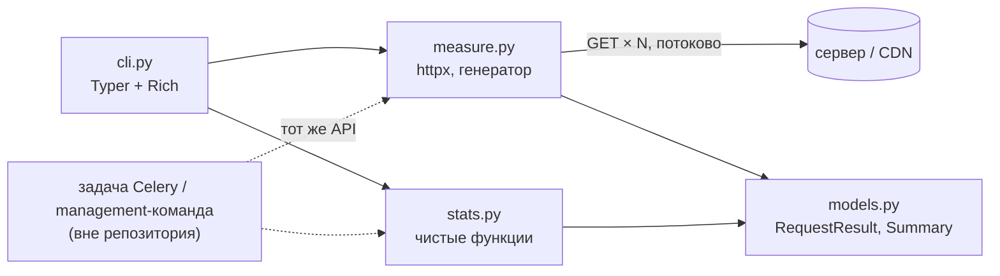

# net-speedmeter

[](https://github.com/scrollDynasty/net-speedmeter/actions/workflows/ci.yml)

Консольный замерятель скорости интернета. Скачивает тяжёлый файл (по умолчанию фотографию 14.7 MB)
**10 раз подряд** и печатает среднее время запроса, объём скачанных данных и скорость в **MB/s**
(рядом — в Mbit/s).

> **Тестовое задание:** «Написать скрипт-замерятель скорости интернета со своего компьютера. Он должен принимать адрес,
> куда стучаться (какая-нибудь тяжелая картинка), запускать последовательно 10 запросов к этому адресу, дожидаться
> ответа, вычислять среднее время запроса, объем скачанных данных и печатать в консоли скорость мб/с.»

| Требование | Где в решении |
|---|---|
| принимает адрес | аргумент `URL` (по умолчанию — картинка с Wikimedia Commons) |
| 10 последовательных запросов | `-n 10` по умолчанию, строго по одному, каждый ответ дочитывается до конца |
| среднее время запроса | строка `Avg request time` |
| объём скачанных данных | строка `Downloaded` |
| скорость, мб/с | строка `Speed`: MB/s и Mbit/s — «мб/с» в ТЗ можно прочитать и так, и так |

## Запуск

Нужен Python 3.11+ и [uv](https://docs.astral.sh/uv/) (`pip install uv`, либо `winget install astral-sh.uv`,
либо `curl -LsSf https://astral.sh/uv/install.sh | sh`).

```bash
git clone https://github.com/scrollDynasty/net-speedmeter.git
cd net-speedmeter
uv run net-speedmeter -n 3       # быстрая проверка: 3 запроса к картинке по умолчанию
uv run net-speedmeter            # полный прогон по ТЗ: 10 запросов, ~150 MB
```

Полный прогон на медленном канале до Wikimedia может занять несколько минут. Другой источник:

```bash
uv run net-speedmeter "https://speed.cloudflare.com/__down?bytes=25000000" -n 5
```

<details>
<summary>Без uv: pip + venv</summary>

```bash
python -m venv .venv
source .venv/bin/activate        # Windows PowerShell: .venv\Scripts\Activate.ps1
pip install .
net-speedmeter -n 3              # или: python -m net_speedmeter -n 3
```
</details>

<details>
<summary>Docker</summary>

```bash
docker build -t net-speedmeter .
docker run --rm -t net-speedmeter -n 3      # -t нужен для прогресс-бара
```
</details>

## Пример вывода

Реальный прогон с домашнего канала:

```text
$ uv run net-speedmeter
net-speedmeter 0.2.0
URL:      https://upload.wikimedia.org/wikipedia/commons/3/3f/Fronalpstock_big.jpg
Requests: 10 sequential GET, keep-alive

[ 1/10] 200   14.68 MB   12.974 s  TTFB 605.3 ms     1.13 MB/s      9.05 Mbit/s
[ 2/10] 200   14.68 MB    8.035 s  TTFB 106.9 ms     1.83 MB/s     14.62 Mbit/s
[ 3/10] 200   14.68 MB    8.851 s  TTFB 105.7 ms     1.66 MB/s     13.27 Mbit/s
[ 4/10] 200   14.68 MB    9.406 s  TTFB 210.1 ms     1.56 MB/s     12.48 Mbit/s
[ 5/10] 200   14.68 MB    7.742 s  TTFB 107.4 ms     1.90 MB/s     15.17 Mbit/s
[ 6/10] 200   14.68 MB    6.275 s  TTFB 111.2 ms     2.34 MB/s     18.72 Mbit/s
[ 7/10] 200   14.68 MB    4.625 s  TTFB 107.0 ms     3.17 MB/s     25.39 Mbit/s
[ 8/10] 200   14.68 MB    5.577 s  TTFB 103.4 ms     2.63 MB/s     21.06 Mbit/s
[ 9/10] 200   14.68 MB    5.521 s  TTFB 104.8 ms     2.66 MB/s     21.27 Mbit/s
[10/10] 200   14.68 MB    5.164 s  TTFB 103.6 ms     2.84 MB/s     22.74 Mbit/s

Summary
Requests          10/10 succeeded
Downloaded        146.79 MB (146,794,740 bytes)
Avg request time  7.417 s
Spread            min 4.625 s, median 7.008 s, max 12.974 s, stdev 2.550 s
Avg TTFB          166.5 ms
Speed             1.98 MB/s = 15.83 Mbit/s  (all requests: total bytes / total time)
Without #1        2.16 MB/s = 17.27 Mbit/s  (#1 includes DNS+TCP+TLS and TCP slow start)
Body transfer     2.02 MB/s = 16.20 Mbit/s  (excluding TTFB)
Per-request       median 2.12 / p90 2.88 / min 1.13 / max 3.17 MB/s
```

Первый запрос заметно медленнее остальных: он открывает соединение (DNS, TCP, TLS) и проходит TCP slow start.
Поэтому кроме общей скорости по ТЗ скрипт показывает строку `Without #1` — скорость без первого запроса.
В интерактивном терминале во время загрузки виден прогресс-бар.

## Параметры

| Параметр | По умолчанию | Описание |
|---|---|---|
| `URL` | картинка 14.7 MB | что скачивать, только `http`/`https` |
| `-n, --count` | `10` | число последовательных запросов (1–1000) |
| `--timeout` | `30` | таймаут в секундах на каждую сетевую операцию: подключение и каждое чтение |
| `--no-keepalive` | — | открывать новое соединение на каждый запрос («холодный» замер) |
| `--json` | — | машиночитаемый вывод: `uv run net-speedmeter --json \| jq .summary.speed_mbyte_s` |

Коды выхода:

| Код | Значение |
|---|---|
| `0` | все запросы успешны |
| `1` | часть запросов завершилась ошибкой |
| `2` | неверные аргументы |
| `3` | все запросы завершились ошибкой |
| `4` | ошибка окружения, например неверный `HTTPS_PROXY` |
| `130` | прервано через Ctrl+C, сводка печатается по завершённым запросам |

## Методика

- **Время** берётся из `time.perf_counter()`: часы монотонные и не прыгают при синхронизации NTP.
  - **Время запроса** — от начала запроса до последнего байта тела.
  - **TTFB** — от начала запроса до получения заголовков ответа, аналог `time_starttransfer` в curl.
  - На новом соединении оба значения включают DNS, TCP и TLS.
- **Объём** — байты тела HTTP в том виде, в каком они пришли по сети (`num_bytes_downloaded` в httpx,
  до распаковки). Заголовки и служебные байты TLS/TCP не считаются, как и в `size_download` у curl.
  - Клиент шлёт `Accept-Encoding: identity`, чтобы сжатие не исказило объём.
  - Тело читается потоково и сразу выбрасывается, поэтому файл на 1 GB не занимает память.
- **Скорость = Σ байтов / Σ времени запросов**, а не среднее скоростей отдельных запросов.
  - Пример: 10 MB за 1 с и 10 MB за 9 с — это 20 MB за 10 с, то есть 2 MB/s. Среднее двух скоростей дало бы
    завышенные 5.6 MB/s.
  - Эта формула равна «средний объём / среднее время запроса», то есть прямо следует из ТЗ.
- **Дополнительно** показываются:
  - скорость без первого запроса;
  - скорость чистой передачи тела (без TTFB);
  - медиана, p90, минимум и максимум по запросам (p90 так же считает Cloudflare Speed Test).
- **Ошибки не портят статистику.**
  - Запрос считается неуспешным при ответе не-2xx, обрыве соединения или несовпадении `Content-Length`
    с полученным объёмом.
  - Такие запросы видны в выводе и влияют на код выхода, но в средние не попадают.
- **Единицы десятичные**, как у провайдеров: 1 MB/s = 10⁶ байт/с = 8 Mbit/s.
- **Честный клиент.**
  - Скрипт передаёт User-Agent вида `net-speedmeter/<версия> (+ссылка на репозиторий)`.
    Этого требует [политика Wikimedia](https://foundation.wikimedia.org/wiki/Policy:User-Agent_policy):
    запросы без него получают 403.
  - Заголовок `Cache-Control: no-cache` просит промежуточные кэши не отдавать сохранённую копию, хотя CDN
    вправе его проигнорировать.
  - Случайный параметр к URL для обхода кэша не добавляется: иначе каждый запрос уходил бы с CDN на
    исходный сервер Wikimedia, а это лишняя нагрузка на чужую инфраструктуру.

Какой файл брать: чем он больше, тем меньше на результат влияют задержка и разгон TCP.
Для каналов быстрее 100 Mbit/s лучше файлы от 25–100 MB.

| URL | Размер |
|---|---|
| `https://upload.wikimedia.org/wikipedia/commons/3/3f/Fronalpstock_big.jpg` | 14.7 MB, по умолчанию |
| `https://speed.cloudflare.com/__down?bytes=N` | любой меньше 100 MB (при N ≥ 10⁸ отвечает 403) |
| `https://nbg1-speed.hetzner.com/100MB.bin` | 100 MB, есть также `1GB.bin` |

### Ограничения и что сознательно не сделано

- **Один поток, одно соединение — как просит ТЗ.**
  - M-Lab NDT7 тоже мерит в один поток.
  - Ookla Speedtest открывает несколько соединений, поэтому на быстрых каналах его цифры выше.
- **Это скорость до конкретного сервера**, а не «интернета вообще»: результат зависит от маршрута и загрузки CDN.
- **Прокси учитываются.** Если в окружении задан `HTTPS_PROXY`, замер пойдёт через прокси, как у любого
  HTTP-клиента.
- **Только HTTP/1.1, только скачивание.**
- **Прогресс-бар чуть занижает результат** на скоростях от ~500 Mbit/s. В режиме `--json` он отключён.
- **Сознательно не делал:**
  - параллельные потоки;
  - замер отдачи;
  - запуск по расписанию;
  - хранение истории.

  Всё это выходит за рамки задачи. Ниже показано, куда это встраивалось бы.

## Как устроено



Стрелки показывают направление зависимостей: CLI знает о ядре, ядро о CLI — нет.

- `measure` скачивает и отдаёт результаты по одному: это генератор, поэтому при Ctrl+C уже полученные данные сохраняются.
- `stats` — чистые функции без ввода-вывода.
- `models` — неизменяемые dataclass-ы с `to_dict()`. Он задаёт тот же JSON, что и `--json`.

Ядро можно использовать как библиотеку:

```python
from net_speedmeter import iter_benchmark, summarize

summary = summarize(list(iter_benchmark("https://cdn.example.com/creative.jpg", count=5, timeout=10)))
summary.throughput   # байт/с, None если все запросы упали
summary.to_dict()    # готово для JSONField / результата задачи Celery
```

Набросок того, как это встроилось бы в мониторинг скорости отдачи лендингов и креативов. **Это не реализовано:**

```python
@shared_task(soft_time_limit=300)
def check_delivery_speed(target_id: int) -> None:
    target = SpeedTarget.objects.get(pk=target_id)
    summary = summarize(list(iter_benchmark(target.url, count=5, timeout=10)))
    SpeedCheck.objects.create(target=target, geo=settings.WORKER_GEO, raw=summary.to_dict())
```

Мерить нужно воркером, который физически стоит в нужном гео (своя очередь на каждое гео).
Через прокси измерится канал прокси, а не то, как CDN отдаёт контент пользователям в этом регионе.

## Разработка

```bash
uv sync
uv run pytest --cov        # 94 теста, покрытие ~98%
uv run ruff check . && uv run ruff format --check . && uv run mypy
```

CI на каждый push проверяет:

- ruff и mypy в строгом режиме;
- тесты на Ubuntu и Windows с Python 3.11–3.13, плюс macOS;
- отдельную сборку с минимальными заявленными версиями зависимостей;
- сборку Docker-образа.

Интеграционные тесты поднимают настоящий локальный HTTP/1.1-сервер. Так проверяется переиспользование
соединения и обрыв ответа на реальных сокетах, а не на моках.

## Как использовался AI

Решение написано с помощью Claude Code. Я ставил задачи, проверял результат и принимал решения.

**Методика:** сначала сверил её с первоисточниками — исходниками httpx, описаниями Cloudflare Speed Test и M-Lab NDT7,
политикой Wikimedia. Потом сравнил результаты с `curl` на одном канале.

**Ревью:** после первой версии провёл отдельное ревью силами нескольких агентов в разных ролях: Python-ревьюер,
архитектор, сетевой специалист, QA с ручным мутационным тестированием, DevOps, «новый пользователь» и
нанимающий техлид.

Что ревью и проверки поймали за AI, и что я с этим сделал:

| Что было | Что сделано |
|---|---|
| В CI оказался несуществующий тег `astral-sh/setup-uv@v10`, первый прогон упал | action закреплён на SHA коммита |
| Минимальная версия `typer>=0.15` была взята «из головы» и на деле не работала | исправлено, и теперь CI отдельно проверяет минимальные версии |
| Чтение «для эффективности» чанками по 256 KiB на замере оказалось на ~25% медленнее | убрано |
| `str.isdigit()` при разборе `Content-Length` пропускал `"²"` и падал | заменено |
| Округление печатало `1000.00 kB` | исправлено |
| 12 изменений логики, которые не ловил ни один тест (мутационное тестирование) | добавлены тесты |
| Ревьюер в роли техлида предлагал свернуть проект в один файл на 60 строк | отклонено: разделение на слои и тесты оставил, лишнее убрал (половину README, лишние джобы CI, опцию `--chunk-size`) |
